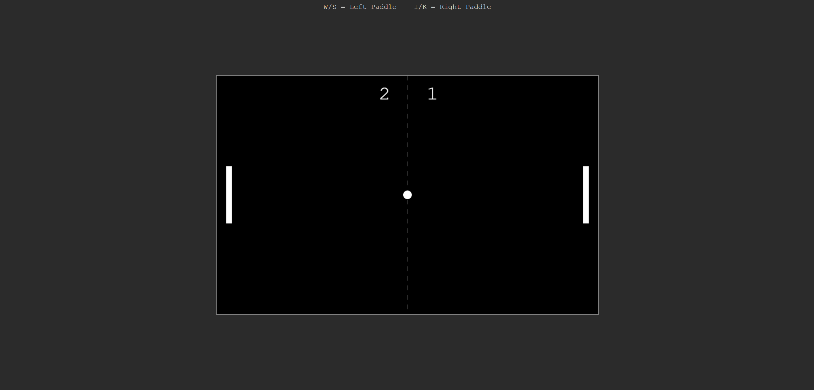

# Speedy-Pong

A browser-based Pong clone made from HTML, CSS, and JavaScript.

**Features**

* First player to score 10 points wins
* After each collision with a paddle, the ball will speed up

**How to run it**

Just double-click speedypong.html or go to 

**Controls**

Left paddle: W / S for up / down
Right paddle: I / K for up / down

Made as a submission for Hack Club Twist.
